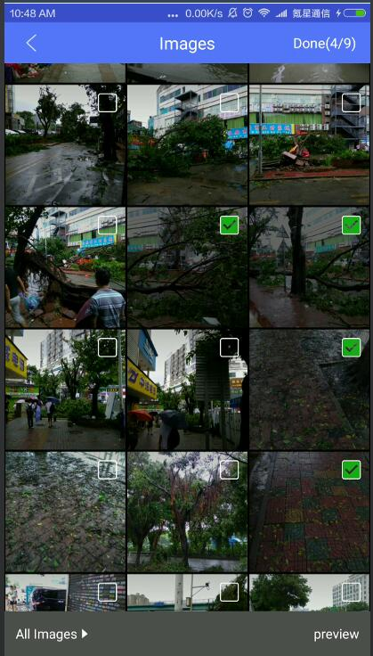
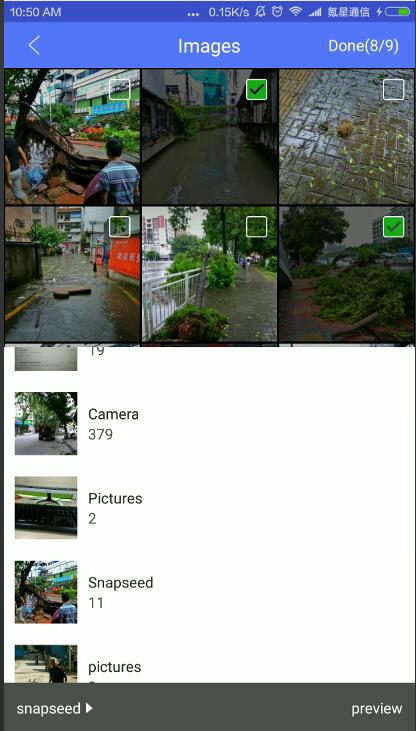

# 微信ui版的PhotoPicker
本项目fork 自[photoPicker](https://github.com/donglua/PhotoPicker)


参考微信的图片选择ui，对原项目photoPicker进行改写。

标题栏：去除难用的toolbar，改成自定义的titlebar。高度44dp，标题居中，颜色引用activity主题设置colorPrimary.可以自己设置.

底部弹出框：原项目两边有间距，现改成铺满屏幕宽度弹出

默认图片更改成黑灰色背景，让滑动时图片闪动不会那么突兀

图片item再加一层蒙版，未选择状态时，由中间向上下浅黑透明渐变，选择状态下，颜色变黑。

选择框： 未选状态下由原来的不透明变成透明，选中状态时图标颜色使用微信的绿色。


demo apk：见项目根目录下demo.apk


---

# 效果图
 


文件夹切换：底部弹窗


 


图片预览：

 


---

# Usage

### gradle 还未上传，直接拉源代码吧。

或者使用aar：见项目根目录下PhotoPicker-release.aar


### Pick Photo
```java
PhotoPickUtils.startPick(this);
```

### 

### onActivityResult
```java
 @Override protected void onActivityResult(int requestCode, int resultCode, Intent data) {
    super.onActivityResult(requestCode, resultCode, data);
    PhotoPickUtils.onActivityResult(requestCode, resultCode, data, new 		PhotoPickUtils.PickHandler() {
      @Override
      public void onPickSuccess(ArrayList<String> photos) {//已经预先做了null或size为0的判断
       
      }

      @Override
      public void onPickFail(String error) {
        Toast.makeText(MainActivity.this,error,Toast.LENGTH_LONG).show();
      }

      @Override
      public void onCancle() {
        Toast.makeText(MainActivity.this,"取消选择",Toast.LENGTH_LONG).show();
      }
    });
```

### manifest
```xml
<manifest xmlns:android="http://schemas.android.com/apk/res/android"
    >
  <uses-permission android:name="android.permission.WRITE_EXTERNAL_STORAGE"/>

  <application
    ...
    >
    ...
    
    <activity android:name="me.iwf.photopicker.PhotoPickerActivity"
      android:theme="@style/customTheme" 
       />

    <activity android:name="me.iwf.photopicker.PhotoPagerActivity"
      android:theme="@style/customTheme"/>
    
  </application>
</manifest>
```
### Custom style
```xml
<style name="customTheme" parent="Theme.AppCompat.Light.NoActionBar">
  <item name="colorPrimary">#FFA500</item>//标题栏背景色
  <item name="colorPrimaryDark">#CCa500</item>
</style>
```


### Proguard

```
# Glide
-keep public class * implements com.bumptech.glide.module.GlideModule
-keep public enum com.bumptech.glide.load.resource.bitmap.ImageHeaderParser$** {
    **[] $VALUES;
    public *;
}
# nineoldandroids
-keep interface com.nineoldandroids.view.** { *; }
-dontwarn com.nineoldandroids.**
-keep class com.nineoldandroids.** { *; }
# support-v7-appcompat
-keep public class android.support.v7.widget.** { *; }
-keep public class android.support.v7.internal.widget.** { *; }
-keep public class android.support.v7.internal.view.menu.** { *; }
-keep public class * extends android.support.v4.view.ActionProvider {
    public <init>(android.content.Context);
}
# support-design
-dontwarn android.support.design.**
-keep class android.support.design.** { *; }
-keep interface android.support.design.** { *; }
-keep public class android.support.design.R$* { *; }
```

---

# Thanks 

[Photopicker](https://github.com/donglua/PhotoPicker)

